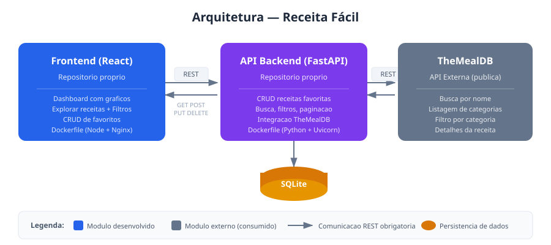

# Receita Fácil Frontend

Interface web para explorar, buscar e gerenciar receitas favoritas. Construída com **React** e **Vite**, integrada ao [Receita Fácil API](https://github.com/senamatos/receita-facil-api) e ao serviço externo [TheMealDB](https://www.themealdb.com/api.php).

## Arquitetura da Aplicação



### Fluxo de Comunicação

| Origem | Destino | Protocolo | Rotas |
|--------|---------|-----------|-------|
| Frontend | API Backend | REST (HTTP) | `GET /recipes/`, `POST /recipes/`, `PUT /recipes/{id}`, `DELETE /recipes/{id}` |
| Frontend | API Backend | REST (HTTP) | `GET /meals/search`, `GET /meals/categories`, `GET /meals/filter`, `GET /meals/{id}` |
| API Backend | TheMealDB | REST (HTTP) | `GET /search.php`, `GET /categories.php`, `GET /filter.php`, `GET /lookup.php` |
| API Backend | SQLite | SQL | Persistência local de receitas favoritas |

## Funcionalidades

- **Dashboard**: visão geral com estatísticas, gráficos por categoria e região, categorias e receitas em destaque
- **Explorar**: busca de receitas por nome, filtro por categoria, visualização detalhada com ingredientes e modo de preparo
- **Favoritos**: lista de receitas salvas com filtros, paginação, avaliação com estrelas e notas pessoais
- **CRUD Completo**: adicionar (POST), visualizar (GET), editar notas (PUT) e remover (DELETE) favoritos

## Tecnologias

- React 18
- React Router DOM
- Recharts (gráficos)
- React Icons
- Axios (HTTP client)
- Vite (build tool)
- CSS Modules
- Docker + Nginx

## API Externa — TheMealDB

O sistema consome a API pública **TheMealDB** para obter dados de receitas do mundo inteiro.

### Informações

| Item | Detalhe |
|------|---------|
| **Nome** | TheMealDB |
| **URL Base** | `https://www.themealdb.com/api/json/v1/1` |
| **Licença** | Creative Commons Attribution-NonCommercial 4.0 |
| **Cadastro** | Não necessário (API gratuita com chave pública `1`) |
| **Documentação** | [themealdb.com/api.php](https://www.themealdb.com/api.php) |

### Rotas Consumidas

| Rota | Descrição |
|------|-----------|
| `GET /search.php?s={nome}` | Buscar receitas por nome |
| `GET /categories.php` | Listar todas as categorias |
| `GET /filter.php?c={categoria}` | Filtrar receitas por categoria |
| `GET /lookup.php?i={id}` | Obter detalhes completos de uma receita |

### Tratamento dos Dados

Os dados da API externa são consumidos e tratados internamente pelo backend (FastAPI). Não há redirecionamento para aplicações externas. Os dados são:
- Parseados e formatados (extração de ingredientes dos 20 campos individuais para um array estruturado)
- Servidos ao frontend através das rotas do backend (`/meals/*`)
- Opcionalmente persistidos no SQLite quando o usuário salva como favorito

## Instalação Local

### Pré-requisitos

- Node.js 18+
- npm

### Passos

```bash
# Clonar o repositório
git clone https://github.com/senamatos/receita-facil-frontend.git
cd receita-facil-frontend

# Instalar dependências
npm install

# Configurar a URL da API (opcional, padrão: http://localhost:8000)
# Edite o arquivo .env se necessário

# Iniciar em modo de desenvolvimento
npm run dev
```

A aplicação estará disponível em `http://localhost:5173`.

## Execução com Docker

### Apenas o Frontend

```bash
docker build -t recipe-hub-frontend .
docker run -p 3000:80 recipe-hub-frontend
```

### Sistema Completo (Frontend + API)

```bash
# Na raiz deste repositório (onde está o docker-compose.yml)
docker compose up --build
```

Isso irá iniciar:
- **Frontend**: `http://localhost:3000`
- **API Backend**: `http://localhost:8000`
- **Swagger (documentação da API)**: `http://localhost:8000/docs`

## Estrutura do Projeto

```
recipe-hub-frontend/
├── public/
├── src/
│   ├── components/
│   │   ├── Navbar.jsx          # Barra de navegação
│   │   ├── Navbar.module.css
│   │   ├── RecipeCard.jsx      # Card de receita
│   │   ├── RecipeCard.module.css
│   │   ├── RecipeModal.jsx     # Modal de detalhes
│   │   └── RecipeModal.module.css
│   ├── pages/
│   │   ├── Dashboard.jsx       # Página inicial com gráficos
│   │   ├── Dashboard.module.css
│   │   ├── Search.jsx          # Busca e exploração
│   │   ├── Search.module.css
│   │   ├── Favorites.jsx       # Gerenciamento de favoritos
│   │   └── Favorites.module.css
│   ├── services/
│   │   └── api.js              # Chamadas HTTP ao backend
│   ├── App.jsx                 # Componente principal com rotas
│   ├── main.jsx                # Ponto de entrada
│   └── index.css               # Estilos globais
├── .env                        # Variáveis de ambiente
├── index.html
├── vite.config.js
├── package.json
├── nginx.conf                  # Configuração do Nginx
├── Dockerfile                  # Build multi-stage (Node + Nginx)
├── docker-compose.yml          # Orquestração dos containers
└── README.md
```
